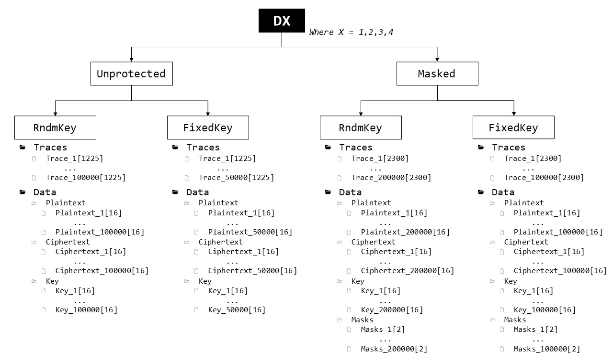
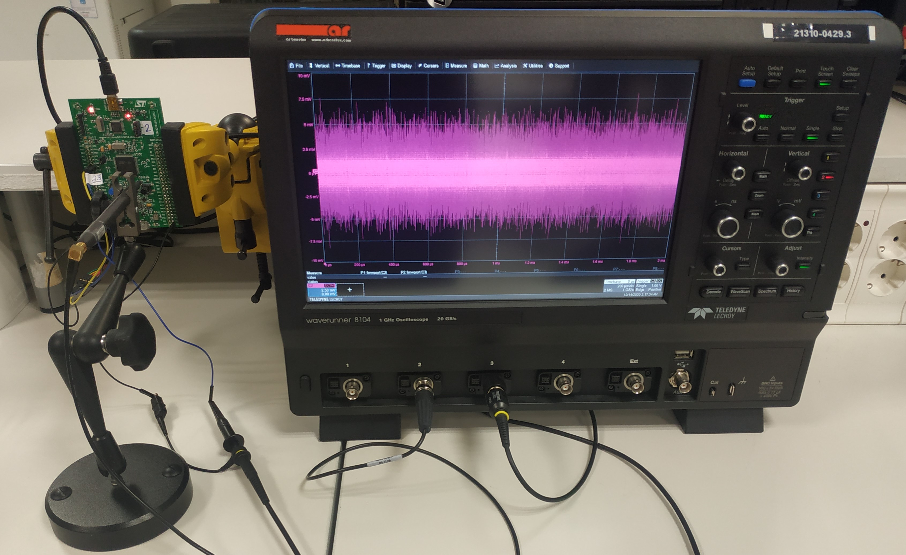

# *AES_PT* Dataset
Motivated by the lack of an open dataset for Side-channel analysis which include traces from different copies of the same deviceperforming criptographic operations, we have generated the *AES_PT* dataset (PT stands for portable). It includes power analysis traces from four copies of the same development board mounting an STM32F411VE high-performance Arm Cortex -M4 32-bit RISC microcontroller working at 100 MHz.  The four copies are called D1, D2, D3, and D4 from now on. This dataset was created with the idea of making "realistic" Template Attacks and therefore includes subsets of traces of each clone device performing unprotected and protected AES-128 implementations, with both fixed and random cryptographic keys.

## Download
The dataset can be downloaded from the following [link](https://drive.google.com/file/d/1fqQ0dByvj43K93kjuIjmpciSGwbqLLuE/view?usp=sharing)

## Dataset Organization
The dataset is stored using the HDF5 format. The entire dataset is contained in a single file *AES_PT.h5* which has 4 groups, one per each clone device, called D1, D2, D3 and D4. In turn, each group is divided into smaller subgroups, as it includes traces of the device performing unprotected and masked AES implementations with both fixed key and random key. An organization chart of how each device group is structured can be seen in the following figure:

In short, the dataset includes 450000 traces per device: 
  - 150000 unprotected AES power traces (100000 traces of the device using random keys and 50000 traces of the device using a fixed key) 
  - 300000 masked AES power traces (200000 traces of the device using random keys and 100000 traces of the device using a fixed key)

Each set of traces includes its corresponding associated data: plaintext, ciphertext, key and mask (input and output mask, only for the Masked AES implementations).

## Acquisition Details
The devices are encrypting 16-byte random plaintexts using two software AES implementations: unprotected AES and masked AES. During that operation, we measure the power consumption of the device with a Langer EM probe attached to a 20 GS/s digital oscilloscope (LeCroy Waverunner 9104) triggered by the microcontroller, which rises a GPIO signal when the internal computation starts. The high sensibility probe is placed over a decoupling capacitor connected to the power line of the device. Each power trace is formed by 1225 samples (2300 for the masked implementation) taken at 1GHz with 8-bit resolution, corresponding to the first S-box operation. Traces are preprocesed by applying zero mean, standarization, waveform realignment, and a lightweight software lowpass filter. Nevertheless, traces are deliberately quite noisy (due to the nature of EM measurements, variations during the acquisition of the traces, constructive differences between the devices, etc.) to serve to represent realistic experimental use cases.

## AES implementation

As mentioned above, the *AES_PT* dataset includes traces of each clone device performing both unprotected AES and masked AES. Both algorithms are implemented in C language. The unprotected AES implementation is a regular AES-128 (in ECB mode) software implementation [[2]](#2). Regarding the masked implementation, it is a modification of the previous which matches the same masking method described in [[1]](#1) (Masked Lookup Table). Below there is a brief explanation of this masking method.

**Masked Lookup Table:** In a masked implementation, each intermediate value *v* is concealed by a random value *m* that is called mask, which is different for each execution and unknown by the attacker, such that *v_m = v * m*. This randomizes the intermediate value, mitigating the dependency between the power consumption of the DUT and the processed intermediate value, and providing security against firt-order DPA attacks. 

<!---
In SCA over software AES implementations on microcontroller, it is common to target the S-box output as sensitive intermediate value *v = S-Box(p * k)*. The S-Box operation is a substitution box (lookup table) used in the Rijndael cipher. Since this dataset includes traces corresponding to the first S-box operation only, we will focus on that part of the masking method (see [[1]](#1)} for the full explanation, including the masking of the rest of intermediate values). 
-->

In a masked implementation, each intermediate value *v* is concealed by a random value *m* that is called mask, which is different for each execution and unknown by the attacker, such that *v_m = v * m*. This randomizes the intermediate value, mitigating the dependency between the power consumption of the DUT and the processed intermediate value, and providing security against firt-order DPA attacks. 

Following the approach in [[1]](#1), the S-Box operation is masked using two (8-bit) masks: the input mask min and the output mask mout. At the beginning of each AES encryption, a masked S-Box table *Sm* is computed with the property *Sm(x * min)* = *S(x)* * mout, and used instead of the original table. Generating the masked table is a simple process, as one only has to run through all (8-bit) inputs * x *, look up *S(x)* and store *S(x)* * mout. 

Regarding the rest of operations, we use two additional (16-byte) masks for the MixColumns operation. The input mask *m* is obtained by generating 16 random bytes and the output mask *mout* is obtained by applying MixColumns operation to *m*. The shift rows opeation does not affect the masking in this scheme ase it just moves the btyes of the state to different positions. The following algorithm represents the pseoudocode of the full AES operation (see [[1]](#1)} for the full explanation):

## References
<a id="1">[1]</a> 
S. Mangard, E. Oswald, T. Popp,
Power Analysis Attacks: Revealing the Secrets of Smart Cards.,
Springer, 2007.

<a id="2">[2]</a> 
Small portable AES-128 in C.,
https://github.com/bitdust/tiny-AES128-C
